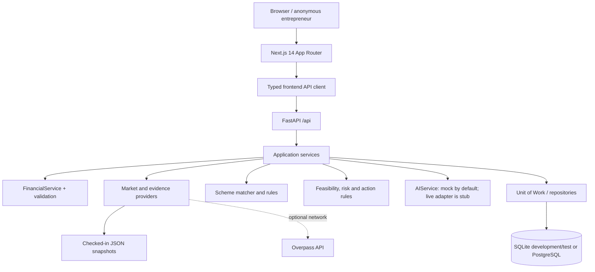

# GramaVise — Master Project Report

> **Know the market. Calculate the risk. Decide before you borrow.**

**Audit date:** 14 September 2026  
**Repository:** `gramavise`  
**Problem statement:** SIH26091 — *AI-Driven Hyper-Local Business Advisory and Financial Structuring Assistant for Rural Micro-Entrepreneurs*

This document is an implementation audit and learning guide. It describes the checked-in code, data files, migrations, tests, and development configuration as they exist today. “Implemented” means that the behavior is present in the repository; “demo”, “prototype”, “mock”, “static”, and “needs verification” are used deliberately where the code says so. This report does not turn a development feature into a production guarantee.

## 1. Executive summary

### Problem and users

Rural and marginalized micro-entrepreneurs, self-help groups, and small local-enterprise creators often have to make a borrowing decision with:

- little hyper-local competition or demand information;
- financial assumptions that are difficult to translate into monthly cash flow, break-even, EMI, and repayment capacity;
- government-scheme rules that are difficult to compare; and
- advice that is hard to explain or verify.

GramaVise is a pre-loan decision-support application. A user enters a business idea, location, capital, operating assumptions, and requested loan. The backend calculates deterministic unit economics, obtains local/provider evidence, matches a small catalog of schemes, evaluates explicit feasibility rules, generates a verification/action plan, and returns a plain-language explanation. It does **not** approve loans, issue a credit score, guarantee a subsidy, or replace a bank appraisal.

### One-paragraph explanation for a student

GramaVise is a pre-loan advisory platform for rural micro-entrepreneurs. Its Next.js wizard collects a business profile and financial assumptions, then calls a FastAPI pipeline. The financial engine calculates revenue, costs, EMI, profit, break-even, and DSCR; provider adapters add OpenStreetMap/snapshot competitors and official or checked-in LGD, Census 2011, Agmarknet/OGD, ODOP, and Udyam evidence; deterministic rules produce `PROCEED`, `VALIDATE_FIRST`, or `RECONSIDER`; and a mock/default AI layer turns the structured result into a readable narrative. Results, evidence, inputs, rules, and scenarios are persisted as point-in-time records in SQLite by default or PostgreSQL when configured. Scenario Lab changes assumptions without changing the baseline, and browser history/draft storage helps an anonymous user return to prior work.

### Core philosophy

The code expresses the following sequence:

```text
Evidence → Calculate → Explain → Decide → Act → Test → Understand
```

The key separation is intentional:

- formulas and verdicts are deterministic;
- evidence includes provenance and verification status;
- AI is an editorial/explanation layer, not the authority for a financial verdict; and
- historical results are read from snapshots rather than recalculated against newer providers.

## 2. Repository and architecture

### High-level diagram



### Major directories

| Area | Actual responsibility |
|---|---|
| `frontend/app/` | App Router pages: landing, onboarding, analysis placeholder/loading, results, schemes, history, historical analysis |
| `frontend/components/` | Onboarding, dashboard, evidence, financial, voice, common, and primitive UI components |
| `frontend/services/api/` | Typed callers for analysis, financial, market, and schemes endpoints |
| `frontend/lib/` | Types, API error handling, demo inputs, i18n, browser storage, voice parser, utilities |
| `backend/app/api/` | FastAPI routers and HTTP orchestration |
| `backend/app/services/` | Financial, geo/market, evidence, scheme, recommendation, AI, persistence services |
| `backend/app/providers/` | Provider boundary and local/optional external evidence adapters |
| `backend/app/rules/` | Financial, feasibility, and scheme decision rules |
| `backend/app/models/` | SQLAlchemy ORM models |
| `backend/app/repositories/` | Repository and Unit of Work persistence abstraction |
| `backend/alembic/versions/` | Five schema migrations (`0001`–`0005`) |
| `backend/tests/` | Pytest API, unit, service, integration, persistence, resilience, and production-hardening tests |
| `data/` | Small seed/legacy data area; active provider snapshots are under `backend/app/data/` |
| `docs/` | Existing technical notes plus this report |
| `scripts/` | Setup and seed helpers |

### Technology stack (versions from manifests, not guesses)

| Technology | Version in repository | Purpose/status |
|---|---|---|
| Next.js | `^14.2.4` | Frontend App Router |
| React / React DOM | `^18.3.1` | UI |
| TypeScript | `^5.4.5` | Frontend types |
| Tailwind CSS | `^3.4.4` | Responsive styling |
| Python container | `3.11-slim` | Backend Docker image; local virtualenv is Python 3.12.10 in this audit |
| FastAPI | `>=0.111,<0.112` | HTTP API |
| Uvicorn | `>=0.30,<0.31` | ASGI server |
| Pydantic / Settings | `>=2.7,<3` / `>=2.3,<3` | Validation and configuration |
| SQLAlchemy | `>=2.0.30,<2.1` | ORM and transactions |
| Alembic | `>=1.13,<1.14` | Migrations |
| PostgreSQL driver | `psycopg2-binary >=2.9.9,<3` | PostgreSQL connectivity |
| HTTPX | `>=0.27,<0.28` | Python HTTP/test client dependency |
| Pytest | `>=8.2,<9` | Backend test runner |
| Docker Compose | file format `3.8`, PostgreSQL `16-alpine` | Optional local stack |

The README mentions Jest/React Testing Library, but no corresponding frontend test dependency is present; the frontend validation is implemented as Node scripts.

## 3. Setup and runtime

### Local development

Prerequisites in the README are Node.js 18+, Python 3.10+, and optionally Docker. The documented flow is:

```text
copy .env.example .env
cd backend
python -m venv .venv
.venv\Scripts\Activate.ps1
pip install -r requirements.txt
uvicorn app.main:app --reload --port 8000

cd frontend
npm install
npm run dev
```

The frontend is normally `http://localhost:3000`; backend OpenAPI is `http://localhost:8000/docs`.

`start.bat` is a Windows convenience launcher. It creates the environment file if missing, creates/installs the backend virtualenv and frontend dependencies if missing, starts both development servers, writes logs to root `.gramavise-*.log` files, waits for port 3000, and opens the browser. It also stops processes listening on ports 8000 and 3000; use it only in a development machine where that behavior is acceptable.

### Configuration

`backend/app/config.py` defaults to `sqlite:///backend/gramavise_dev.db` (resolved to an absolute backend path), `ENVIRONMENT=development`, `DEBUG=True`, mock AI, and a 1 MiB request limit. Set `DATABASE_URL` to PostgreSQL for a deployed database. Production configuration rejects `DEBUG=True` and the default secret key, but authentication is not implemented.

The checked-in root `.env` is a development file. Its `CORS_ORIGINS` value is comma-separated in the template, while Pydantic Settings treats this complex field as JSON before the custom validator; a fresh process should use a valid JSON list or remove the local `.env` override. This is a development configuration issue, not an application feature.

### Docker

`docker-compose.yml` starts PostgreSQL 16, a backend development container with a source volume and reload, and a frontend development container. Backend and frontend Dockerfiles run as non-root users (`appuser` and `node`), but the compose commands are explicitly development commands, not a hardened production deployment.

## 4. Product workflow

```text
Landing (/)
  → New Advisory (/onboarding)
  → four-step profile/location/business/financial wizard
  → validation + sessionStorage/local draft
  → /analysis/loading
  → POST /api/analyze
      → Pydantic validation
      → deterministic financial engine
      → market/evidence providers
      → scheme rules
      → feasibility/risk/action rules
      → AI explanation/fallback
      → atomic snapshots + idempotency record
  → /results
      → numbers, evidence, schemes, action plan, Scenario Lab
  → save scenario or open /history
  → GET /api/analyze/{id} for immutable historical view
```

### Step-by-step behavior

1. **Landing:** explains the advisory concept and links to onboarding and the schemes directory. Some landing visual copy is presentational; it is not a separate calculation.
2. **Onboarding:** four steps collect optional entrepreneur name/phone and experience, state/district/village, business name/category/description, capital/loan and ten financial assumptions. Step-specific client validation prevents navigation when required values are missing.
3. **Draft recovery:** a debounced 300 ms save writes a minimized draft to `localStorage`. The user can continue or start fresh.
4. **Analysis submission:** final validation writes profile, financials, language, and entrepreneur fields to `sessionStorage`, then routes to `/analysis/loading`.
5. **Execution:** the loading page sanitizes the stored values, calls `POST /api/analyze`, validates that the response has an ID, financial result, and verdict, and caches the response in `sessionStorage`.
6. **Backend pipeline:** the route computes financials, gathers market results, matches PMEGP/PMMY/PMFME, evaluates feasibility and risk, builds evidence and verification items, adds number explanations/action/bank readiness, invokes AI, then persists a business profile, analysis, financial input snapshot, financial result snapshot, and optional idempotency record in one Unit of Work.
7. **Results:** the dashboard renders the deterministic verdict, decision trace, financial metrics, break-even chart, local market section, scheme cards, pre-loan actions, AI narrative, and evidence drawer.
8. **Scenario Lab:** a user changes assumptions, receives baseline-versus-scenario metrics and rule comparisons, and can save at most three scenarios against a parent analysis.
9. **History:** the browser stores a local index of analysis IDs (maximum 20). Opening an entry calls the backend authoritative record; deleting a local entry does not delete its backend row.

## 5. Frontend architecture and routes

The frontend is a Next.js App Router application wrapped by `LanguageProvider`, a shared header/footer, and Tailwind responsive classes. State is local React state plus browser storage; there is no Redux or authenticated user session.

| Route | Main behavior, data source, and limitations |
|---|---|
| `/` | Localized landing page and links to onboarding/schemes; no API request required |
| `/onboarding` | Four-step controlled wizard; uses `useBusinessProfile`, sessionStorage, `gramavise_draft_v1`, `DemoScenarioSelector`, and voice buttons on supported numeric fields |
| `/analysis` | A small informational placeholder linking back to onboarding; it is not the execution page |
| `/analysis/loading` | Reads/sanitizes sessionStorage, calls `runAnalysis`, handles missing data/offline/timeout/server errors, caches result, then navigates to `/results` |
| `/results` | Reads the latest result from sessionStorage; it does not fetch by ID. Without a cached result it shows an empty state |
| `/schemes` | Fetches `GET /api/schemes`; initially displays a static three-card fallback; formats absent/zero fields as `N/A` or `0%` |
| `/history` | LocalStorage index, status badges, delete-local-entry confirmation, and links to historical IDs |
| `/history/[analysis_id]` | Fetches `GET /api/analyze/{id}`, marks the local pointer opened, renders the same dashboard with a historical banner, and offers “Use as Starting Point” by staging snapshots into sessionStorage |

### Browser persistence

- `sessionStorage`: current profile, financials, entrepreneur data, language, latest result, and result timestamp. It is tab/session scoped.
- `localStorage`: draft (`gramavise_draft_v1`, seven-day expiry) and history index (`gramavise_history_v1`, maximum 20 entries). It is device/browser scoped.
- History is anonymous: the pointer is local, while the UUID record is backend-authoritative. There is no account ownership or authorization check.

### Internationalization

The dictionaries are `en`, `hi`, `mr`, `bn`, `te`, and `ta` (English, Hindi, Marathi, Bengali, Telugu, Tamil). Nested dot-path lookup tries the selected dictionary, then English, then returns the key. Language is selected in the UI and persisted in sessionStorage; the analysis request includes the preferred language. The repository’s i18n check reports 501 canonical English keys and 100% parity in all five Indic dictionaries. The mock AI response itself is hardcoded in English, so backend narrative localization is not complete.

### Accessibility and responsive behavior

Components use semantic navigation/alerts, labels, `aria-*` attributes, visible focus/error states, a focus-trap hook for modals, keyboard-friendly buttons, and responsive Tailwind breakpoints. This is implementation evidence, not a formal WCAG audit. Browser speech recognition is optional and falls back to typed input.

## 6. Backend architecture and API

`backend/app/main.py` creates FastAPI 1.0.0, installs request-size, CORS, and request-ID middleware, mounts health routes at both root and `/api`, and mounts domain routes under `/api`. Validation errors return 422 with structured Pydantic errors; HTTP errors retain status and request ID; unhandled errors are logged server-side and return a sanitized 500.

### Routes

| Method/path | Actual behavior |
|---|---|
| `GET /health`, `GET /api/health` | Liveness only; does not query the database |
| `GET /ready`, `GET /api/ready` | Executes `SELECT 1`; returns 503 with `database=unavailable` if it fails |
| `POST /api/analyze` | Full advisory pipeline and atomic persistence; optional `Idempotency-Key` |
| `GET /api/analyze/{analysis_id}` | UUID validation and immutable snapshot retrieval; no recalculation/providers |
| `POST /api/analyze/scenario` | In-memory deterministic baseline/scenario comparison |
| `POST /api/analyze/{analysis_id}/scenarios` | Calculates and saves a scenario; maximum three per parent; optional idempotency |
| `GET /api/analyze/{analysis_id}/scenarios` | Lists saved scenario snapshots |
| `GET /api/analyze/{analysis_id}/scenarios/{scenario_id}` | Retrieves a saved scenario only under its parent |
| `POST /api/financial/calculate` | Validated financial calculation |
| `POST /api/financial/sensitivity` | Four built-in stress cases and resilience rating |
| `GET /api/market/evidence` | Market result from snapshot providers and optional Overpass |
| `POST /api/ai/explain` | AIService structured explanation; default provider is mock |
| `GET /api/schemes` | Active persistent catalog, with static service fallback if unseeded |
| `GET /api/schemes/{scheme_code}` | One catalog item and active version |
| `GET /api/schemes/{scheme_code}/versions` | Version history |

### `POST /api/analyze` lifecycle

1. If a key is supplied, SHA-256 fingerprint the request and replay an existing completed analysis for the same key/scope/fingerprint.
2. Reject a reused key with a different payload as 409.
3. Validate financial and capital bounds.
4. Calculate financial results.
5. Build a market query and gather competitor, administrative, demographic, price, and Udyam context.
6. Match schemes and evaluate feasibility/risk.
7. Build the evidence ledger, heuristic confidence, verification checklist, number explanations, action plan, document readiness, and bank readiness.
8. Ask AIService for a structured narrative; on failure use the deterministic decision trace/action fallback.
9. Generate a UUID response and persist all snapshots atomically through repositories/Unit of Work.
10. A persistence conflict is rolled back; same-key same-payload can replay, while other persistence errors return a sanitized 500.

### Repositories and Unit of Work

Repositories encapsulate SQLAlchemy queries. `UnitOfWork` opens one session, exposes user/business/analysis/snapshot/scheme/scenario/idempotency repositories, and owns commit/rollback/close. `init_db()` exists for tests/local standalone use; Alembic is the intended production schema authority.

## 7. Financial engine

Inputs are startup cost, equipment cost, inventory cost, monthly fixed cost, customers/day, average ticket, working days/month, variable-cost percentage, annual interest rate, and loan tenure, plus own capital and optional desired loan.

### Formulas implemented

Let `D` be customers/day, `P` average ticket, `W` working days, `v` variable-cost percentage, `F` fixed monthly cost, `L` selected loan, and `E` EMI.

```text
Total capex = startup_cost + equipment_cost + inventory_cost
Required loan = desired_loan when desired_loan > 0
                otherwise max(0, total_capex - max(0, own_capital))
Monthly revenue = D × P × W
Variable cost = monthly revenue × (v / 100)
Gross profit = monthly revenue - variable cost
```

For a positive-rate loan, `r = (annual_rate_pct / 100) / 12` and `n = loan_tenure_months`:

```text
EMI = L × r × (1+r)^n / ((1+r)^n - 1)
```

At zero interest, EMI is `L / n`. Non-positive principal/tenure produces zero EMI. Calculated monetary values are generally rounded to two decimal places.

```text
Net operating income (NOI) = gross profit - fixed cost
Net profit = gross profit - fixed cost - EMI
Net profit margin = net profit / monthly revenue × 100 (or 0 if revenue is 0)
Contribution margin ratio = 1 - v / 100
Total fixed burden = max(0, fixed cost) + max(0, EMI)
Break-even monthly revenue = total fixed burden / contribution margin ratio
Break-even daily units = ceil(break-even monthly revenue / (P × W))
DSCR = NOI / EMI
```

DSCR is returned as `0.0` when EMI is zero (debt-free) or NOI is non-positive. It is cash available before debt service divided by the monthly debt service, not a credit score. Financial viability is `net_profit > 0` and DSCR `>= 1.25` when debt exists; debt-free viability only requires positive net profit.

### Validation and edge cases

Pydantic and service validation reject negative costs/capital/loan, non-positive customer volume or ticket price, working days outside 1–31, variable cost >=100%, negative interest, interest >100% at service level (schema is stricter at 40%), and non-positive tenure. The UI applies a 0–40% interest and 1–120 month range. Zero capex and debt-free cases are safe; a zero contribution margin returns zero break-even values rather than dividing by zero. No tax, depreciation, inflation, seasonality, working-capital cycle, collateral value, or lender-specific amortization is modeled.

### Sensitivity endpoint

`POST /api/financial/sensitivity` evaluates baseline plus:

1. demand dip: customers/day × 0.80;
2. price compression: ticket × 0.90;
3. variable-cost escalation: percentage × 1.15, capped at 95%;
4. combined case: volume × 0.85 and variable-cost percentage × 1.10, capped at 95%.

Each is `VIABLE` when profit is positive and debt-free or DSCR >=1.25, `STRESSED` when profit is positive and DSCR is 1.00–1.24, otherwise `INSOLVENT`. Resilience is `HIGH`, `MODERATE`, or `LOW` from the count of stressed/insolvent scenarios.

## 8. Recommendation and confidence

### Deterministic verdict rules

`FeasibilityRules.evaluate_with_trace()` records rule-level evidence:

- net profit must be `> 0`;
- if EMI exists, DSCR must be `>= 1.0` to avoid a critical solvency failure;
- DSCR `>= 1.50` is the strong safety buffer; 1.00–1.49 is a warning;
- the financial engine’s `is_financially_viable` must pass;
- direct mapped competitors `<= 3` passes the competition rule; more is a warning;
- low OpenStreetMap coverage is always a warning requiring physical verification.

Decision order:

```text
Any critical failure, net profit <= 0, or debt DSCR < 1.00 → RECONSIDER
Otherwise: strong DSCR/debt-free + financial viability + <=3 competitors → PROCEED
Otherwise → VALIDATE_FIRST
```

The verdict authority is `FeasibilityRules`; AI cannot override it. `PROCEED` means the tested assumptions pass these rules, not loan approval. `VALIDATE_FIRST` means mathematically solvent but boundary conditions or market coverage need validation. `RECONSIDER` means the modeled economics or solvency fail.

### Confidence

`EvidenceCollector.calculate_confidence()` is the arithmetic mean of the individual evidence `confidence` values, rounded to two decimals. Evidence types are labeled `OBSERVED`, `CALCULATED`, `MODELLED`, `ASSUMED`, or `NEEDS_VERIFICATION`; the separate `services/evidence/confidence.py` also defines type weights but the main analysis route uses the collector’s unweighted mean. This is a heuristic completeness/quality indicator, not statistically calibrated probability, credit scoring, or a lender decision.

## 9. Market and evidence intelligence

### Providers actually present

| Provider | Current implementation |
|---|---|
| LGD | `GeoDataProvider` reads `backend/app/data/geo/lgd_master.json` for administrative identity/codes |
| Census | `DemographicDataProvider` reads checked-in Census 2011 village/district observations and labels them historical |
| Agmarknet/OGD | `PriceDataProvider` reads `backend/app/data/pricing/mandi_prices_master.json`, resolves a conservative commodity mapping, and returns source/freshness metadata; it does not fetch live OGD in the normal path |
| PMFME ODOP | `OdopDataProvider` reads `backend/app/data/odop/odop_national_master.json` for alignment |
| Udyam | `UdyamContextProvider` reads district-level aggregates from `backend/app/data/udyam/udyam_district_master.json`; this is not nearby competitor data |
| OpenStreetMap | `OSMCompetitorProvider` reads `backend/app/data/osm/osm_poi_snapshot.json` by default; optional Overpass network is enabled only when `GRAMAVISE_ENABLE_OVERPASS_NETWORK` is true |

`Nominatim` and several government API URLs appear in configuration/documentation, but the normal market path uses local snapshots. Provider failures produce `NEEDS_VERIFICATION` fallback evidence rather than crashing the advisory pipeline.

### Catchment, competitors, demand, and prices

The default catchment is 5 km. Competitors are filtered by deterministic category tag rules, classified `DIRECT` or `ADJACENT`, and measured using straight-line Haversine distance—not driving distance. A zero mapped count is low coverage and explicitly does **not** mean no competition. Catchment population is currently a fixed modelled prototype baseline of 4,500 residents/900 households and is marked `[DEMO / PROTOTYPE DATA]`; it is not the Census number.

Mandi matching is conservative: exact commodity mapping, then exact market/district, district, or state fallback in the checked-in records. A modal wholesale price can be converted from ₹/quintal to ₹/kg, but it is not a retail price recommendation. Unknown or absent observations are `NEEDS_VERIFICATION`.

The Evidence Ledger carries source, URL/title, method, confidence, limitations, and verification status. A ledger item can be:

- **OBSERVED:** provider-backed record;
- **CALCULATED:** deterministic financial output;
- **MODELLED:** prototype/geometric estimate;
- **ASSUMED:** entrepreneur self-declaration;
- **NEEDS_VERIFICATION:** absent, conditional, stale, or insufficient evidence.

The generated checklist includes an on-ground competitor survey, supplier/APMC price inquiry, scheme document checks, and a three-day footfall count as applicable. This conservative labeling is why GramaVise does not pretend that missing rural data is reliable data.

## 10. Government schemes

The checked-in catalog has PMEGP, PMMY/MUDRA, and PMFME JSON definitions. `seed_schemes.py` inserts master schemes and immutable active `2024.1` versions into `schemes` and `scheme_versions`; it is idempotent and is not run automatically at startup.

| Scheme | Matching logic in code | Important caveat |
|---|---|---|
| PMEGP | New/greenfield enterprise, project ceiling ₹50 lakh manufacturing or ₹20 lakh services, baseline rural 25% subsidy and 10% own contribution; enhanced special-category 35%/5% is a condition to verify | `PARTIALLY_ELIGIBLE` is an informational match; age, certificates, rural proof, education thresholds, bank appraisal, and exclusions still matter |
| PMMY/MUDRA | Chooses Shishu (≤₹50k), Kishore (₹50,001–₹5L), Tarun (₹5L–₹10L), or Tarun Plus (₹10L–₹20L); no subsidy; margin rules and Tarun Plus prior repayment condition | The service hardcodes `has_prior_tarun_repayment=False`, so Tarun Plus is normally partial |
| PMFME | Food/agro processing keywords; 35% capital subsidy capped at ₹10 lakh and 10% own contribution; new units need ODOP alignment, existing non-ODOP units can be considered for upgradation | ODOP alignment and FSSAI/Udyam/documentary conditions are not a guarantee |

Scheme matching means “the submitted facts match a rule profile.” It is not a sanction, subsidy release, government guarantee, or approval. Source URLs and 2024.1 metadata are provenance, not a live government decision.

## 11. AI architecture

`AIService` selects `MockAIProvider` when `LLM_PROVIDER=mock` or no API key is present. The mock returns a fixed Pydantic `AIExplanationResponse` (English summary, strengths, cautions, next steps, disclaimer) and does not use the prompt values to generate a personalized model response. The full analysis route catches provider errors and falls back to the deterministic decision trace and action plan.

`LLMProvider` exists as an abstraction, but its live `generate()` returns `"Live LLM response stub"` and its structured method returns an unpopulated `model_construct()` when a key is supplied. No OpenAI, Gemini, or Anthropic SDK is in `requirements.txt`; live structured LLM integration is therefore incomplete. The AI layer is not required for financial calculation, evidence collection, or recommendation.

Prompts receive structured financial summary, scheme matches, risks, location, verdict, and preferred language. The intended grounding boundary is clear in code: deterministic values and evidence are inputs; AI writes an explanation; rules decide. The current mock’s English-only fixed text is a demo/development limitation, not production multilingual AI.

## 12. Scenario Lab

`POST /api/analyze/scenario` uses `ScenarioComparator` to validate baseline and overrides, calculate both with the same `FinancialService`, preserve the market context, evaluate both with `FeasibilityRules`, compare metrics/rules, and explain “what changed” and “why it changed.” It never mutates the baseline.

Saved scenarios (`POST /api/analyze/{analysis_id}/scenarios`) reconstruct baseline financial inputs from the immutable input snapshot, enforce a maximum of three records per parent, persist scenario inputs/results/comparison JSON, and support idempotent replay. Reads of saved scenarios return stored JSON without live providers or recalculation. PostgreSQL uses a parent row lock for the ceiling; SQLite is suitable for development/tests but does not provide PostgreSQL’s locking behavior.

Verified demo stress behavior:

- **Kisan Flour Mill, −20% demand:** `PROCEED` remains `PROCEED`; monthly net profit changes from ₹227,025.91 to ₹176,975.91 and DSCR from 71.42x to 55.89x.
- **Village Dairy Unit, −20% demand:** `VALIDATE_FIRST` changes to `RECONSIDER`; profit changes from ₹2,602.27 to −₹4,222.73 and DSCR from 1.40x to 0.35x.

## 13. Database and immutability

### Models and relationships

- `users`: phone, name, preferred language; no route currently creates/authenticates users.
- `business_profiles`: profile/location/capital, optionally linked to a user.
- `financial_assumptions` and `local_evidence`: legacy relational tables retained in the initial schema.
- `analyses`: verdict, confidence, version fields, and JSON snapshots for business, market, schemes, evidence, trace, action plan, bank readiness, risks, and AI.
- `financial_input_snapshots`: one-to-one, the 12 submitted financial assumptions.
- `financial_result_snapshots`: one-to-one, every deterministic result and number explanations.
- `scenario_records`: child of an analysis, containing scenario inputs, financial result, recommendation, and comparison.
- `schemes` / `scheme_versions`: master catalog and unique `(scheme_code, version)` immutable definitions.
- `idempotency_records`: unique `(key, scope)`, request fingerprint, resource ID, and status.

IDs are UUID strings. Foreign keys connect businesses→users, analyses→businesses, snapshots→analyses, scenarios→analyses, and versions→schemes. Cascades are declared for analysis children and scheme versions. JSON is used for evolving evidence/rule/provider payloads.

### Alembic history

1. `0001_initial_schema.py`: initial users, businesses, financial assumptions, evidence, analyses, schemes.
2. `0002_immutable_analysis_snapshots.py`: input/result snapshot tables and analysis snapshot columns.
3. `0003_scenario_records.py`: saved Scenario Lab records.
4. `0004_versioned_scheme_catalog.py`: scheme versioning and catalog metadata.
5. `0005_idempotency_records.py`: duplicate-request records.

The checked-in backend SQLite file is at Alembic head `0005_idempotency_records`. Historical retrieval maps stored snapshots directly and intentionally does not rerun providers or rules. The current mapper persists the core result and bank/action data; `document_readiness` is not reconstructed in `map_models_to_response`, so a historical response can lack that field even though a fresh response contains it. This is an implementation limitation.

## 14. Idempotency and history

`Idempotency-Key` is optional on analysis and save-scenario mutation endpoints. The server hashes the canonical request payload. Same scope + same key + same fingerprint replays the existing resource and does not create another row or consume a scenario slot. Same key + different payload returns HTTP 409. A database uniqueness constraint and conflict handling cover concurrent duplicate attempts; the implementation does not expose an authenticated owner.

Browser history is an anonymous local pointer list, not an account:

- newly completed results append `{analysis_id, business_name, category, status, created_at}`;
- entries are deduplicated and bounded to 20;
- legacy shapes/verdict labels are normalized;
- opening a historical item calls the backend UUID endpoint;
- local deletion removes only the pointer, not the backend record;
- “Use as Starting Point” copies stored profile/financial snapshots into sessionStorage and starts a new advisory.

## 15. Draft recovery and offline behavior

`gramavise_draft_v1` stores schema version 1, step (1–4), language, profile, financial assumptions, and full name. It autosaves after 300 ms, expires after seven days, discards malformed/expired data, and deliberately excludes passwords, Aadhaar, PAN, and audio. The browser can continue editing offline, but analysis submission is blocked when offline. The API client checks `navigator.onLine`, aborts after 25 seconds, distinguishes offline/timeout/server/malformed/422 errors, and keeps the draft. Historical results already cached in the current session can be viewed offline; a new backend analysis, authoritative history fetch, live provider call, or saved scenario cannot be completed offline.

## 16. Voice input

Voice is a controlled numeric-entry helper, not unrestricted natural-language extraction. The browser Web Speech API (`SpeechRecognition`/`webkitSpeechRecognition`) listens once in a selected `en-IN`, `hi-IN`, `mr-IN`, `bn-IN`, `te-IN`, or `ta-IN` locale. The deterministic parser supports configured numeric fields, currency/magnitude words such as lakh/crore/thousand, percentages, days, months, and years→months. It rejects negatives, invalid text, and out-of-range values, presents a confirmation modal, and only then updates form state. Eight fields are rollout-active; working days, variable cost, interest, and tenure are configured but marked future rollout. Permission denial, unsupported browsers, no speech, network recognition errors, and parse ambiguity fall back to manual typing.

## 17. Demo profiles and verified outputs

Demo scenarios are input objects only; they do not hardcode verdicts or outputs. The following values were evaluated with the current backend engine and current snapshot providers:

| Profile | Inputs (capex / loan / customers × ticket / variable cost) | Verdict | Key outputs | Schemes |
|---|---|---|---|---|
| Kisan Flour Mill | ₹300,000 / ₹150,000 / 35 × ₹500 / 45% | `PROCEED` | Revenue ₹455,000; net profit ₹227,025.91; EMI ₹3,224.09; DSCR 71.42x; break-even 4/day; confidence 0.74 | PMEGP partial (₹75,000 calculated subsidy), MUDRA Kishore eligible |
| Lakshmi Tailoring Centre | ₹170,000 / ₹70,000 / 8 × ₹500 / 30% | `PROCEED` | Revenue ₹104,000; net profit ₹56,007.76; EMI ₹1,792.24; DSCR 32.25x; break-even 2/day; confidence 0.58 | PMEGP partial (₹42,500), MUDRA Kishore eligible |
| Village Dairy Unit | ₹350,000 / ₹300,000 / 15 × ₹250 / 65% | `VALIDATE_FIRST` | Revenue ₹97,500; net profit ₹2,602.27; EMI ₹6,522.73; DSCR 1.40x; break-even 14/day; confidence 0.71; tight repayment cushion | PMEGP partial (₹87,500), MUDRA Kishore eligible |
| Sri Amman Tea & Snacks | ₹150,000 / ₹100,000 / 40 × ₹50 / 55% | `PROCEED` | Revenue ₹52,000; net profit ₹2,839.66; EMI ₹2,560.34; DSCR 2.11x; break-even 36/day; confidence 0.58; high break-even-volume risk | PMEGP partial (₹37,500), MUDRA Kishore eligible, PMFME partial (₹52,500) |

The displayed confidence is the 0–1 heuristic score (for example, `0.74`), not a guarantee. Market coverage and price observations can vary with the checked-in provider snapshot and configuration.

## 18. Recommended 3–5 minute demo

1. Choose **Kisan Flour Mill** in the onboarding demo selector.
2. Submit and show `PROCEED`, revenue/profit/EMI/DSCR, break-even, and the decision trace.
3. Open the local market/evidence drawer: distinguish observed OSM competitors from modelled catchment and unverified price data.
4. Show PMEGP/MUDRA alignment and explain that matching is not approval.
5. Open Scenario Lab and apply −20% demand: the baseline remains intact and Kisan remains `PROCEED`.
6. Return to onboarding, choose **Village Dairy Unit**, and show `VALIDATE_FIRST`, 1.40x DSCR, and tight repayment risk.
7. Apply −20% demand: show profit below zero, DSCR 0.35x, and `RECONSIDER`.
8. If time remains, open History to show backend retrieval and “Use as Starting Point.”

Do not claim live LLM generation, current census, zero real-world competition, subsidy guarantee, or loan approval during the demo.

## 19. Testing and verification

### Backend

The current full run in this repository collected **289 tests and passed all 289** (`pytest -q`, 53.31 seconds). Coverage includes:

- API analysis, financial, and health endpoints;
- calculator, validation, EMI/break-even/sensitivity/reference cases;
- full pipeline, evidence, market, ODOP, Mandi, geo/demographics, scheme matching;
- action/bank readiness, provider boundaries, resilience, and i18n parity;
- persistence/retrieval, historical analysis, snapshots, repositories/Unit of Work;
- idempotency, scenario persistence/Lab, scheme catalog versioning, and production hardening.

There is a five-request concurrent scenario ceiling test. It passed in this run. SQLite’s locking/concurrency behavior is not equivalent to PostgreSQL; the test validates the local implementation, not production database guarantees. The run emitted 544 dependency/deprecation warnings, including `datetime.utcnow()` and Starlette/SQLAlchemy warnings; warnings were not failures.

### Frontend scripts

Existing scripts passed in this audit:

- i18n: 501 keys and 100% parity in all six dictionaries;
- onboarding Step 3 validation across six languages;
- 10 Scenario persistence tests;
- 7 draft-storage tests;
- history storage/migration tests;
- 7 scheme-card formatting tests;
- 16 deterministic voice-parser tests;
- `evaluate_demo_profiles.js`: all four profiles returned HTTP 200 and the outputs above.

The package has `type-check`, `build`, and `lint` scripts, but the repository’s documented test surface is primarily the Node scripts; the backend count above is the authoritative pytest count for this audit. Frontend test scripts evaluate storage/logic and do not constitute browser end-to-end coverage.

## 20. Error handling and security posture

### Error behavior

- Missing/invalid request fields: FastAPI/Pydantic 422.
- Invalid financial ranges: 422 with an `errors` list.
- Invalid analysis/scenario UUID: 422.
- Missing historical parent/record: 404.
- Fourth saved scenario: 409.
- Same idempotency key/different payload: 409.
- Provider failure/missing data: safe result marked `NEEDS_VERIFICATION`.
- AI failure: deterministic fallback narrative.
- Backend exception: sanitized 500 plus correlation ID.
- Frontend network failure: localized retry/error state; draft remains.

### Current demo security versus production

**Implemented safeguards:** explicit CORS allowlist, request IDs, 1 MiB request body limit, sanitized 500 responses, no secrets in source APIs, production setting checks for debug/default secret, non-root Docker users, UUID validation, and no raw database error returned to clients.

**Not implemented:** login/session authentication, authorization/ownership checks, user creation routes, rate limiting, CSRF/session security, encrypted storage, audit identity, per-user history isolation, database TLS/secret management, hardened production headers, and a production deployment configuration. Analysis UUIDs are exposed in the URL and anonymous history is intentionally discoverable by anyone who has the ID. CORS is development-oriented and must be configured for deployment. The default SQLite database is not a production multi-user database.

## 21. What is real versus mock/static

| Feature | Real in code? | Mock/static/demo? | Deterministic? | External dependency? | Notes |
|---|---|---|---|---|---|
| Financial formulas | Yes | No | Yes | No | Pure Python calculations, rounded outputs |
| Verdict/rules | Yes | No | Yes | No | `FeasibilityRules` is authoritative |
| Evidence ledger | Yes | Some inputs | Mostly | Snapshot providers | Explicit provenance and verification labels |
| OSM competitors | Snapshot is real checked-in data; optional network adapter | Snapshot/demo coverage | Yes for same snapshot | Optional Overpass | Default network disabled; rural coverage incomplete |
| Census/LGD/ODOP/Udyam | Checked-in provider records | Freshness is limited | Yes | No normal live call | Historical/district-level limitations are labeled |
| Mandi prices | Checked-in Agmarknet/OGD snapshot | Not necessarily current | Yes | No normal live call | Wholesale observation, not retail recommendation |
| Schemes | Rules and catalog are implemented | Eligibility is informational | Yes | Official portals are references | Seeded version is 2024.1 |
| AI | Interface and mock response | Live provider is a stub | Mock yes | No SDK in requirements | Does not decide; mock is English/fixed |
| Demo scenarios | Input profiles | Presentation convenience | Yes | No | Backend generates actual outputs |
| History | Browser pointer + backend persistence | Anonymous/local index | Yes | API for authoritative row | No accounts |
| Database | SQLAlchemy/Alembic persistence | SQLite is dev/test default | Transactional | PostgreSQL optional | Snapshots are point-in-time |
| Scenario Lab | Full calculate/compare/save path | User assumptions are hypothetical | Yes | No external call during compare | Maximum three saved scenarios |

## 22. Limitations and production readiness

### SIH/demo limitations

- Default AI is a fixed mock narrative; live LLM structured integration is not complete.
- Market data is snapshot-backed; 4,500-person catchment is a labelled prototype model.
- OSM coverage misses informal/unmapped rural businesses.
- Mandi values may be absent or stale and are wholesale observations.
- Anonymous browser history is not an account.
- Scheme data is versioned at `2024.1`, not a live eligibility or sanction system.
- The result page depends on current sessionStorage for a fresh result.
- Frontend script tests are not full browser E2E tests.

### Production limitations

Before production, the repository would need authenticated identity and authorization, per-user history, managed PostgreSQL and migrations, secret/key management, rate limiting, security headers, observability, provider SLAs/freshness jobs, current official scheme/legal review, calibrated confidence methodology, live and schema-validated LLM integration (if desired), a real current-demographics/demand model, formal accessibility/browser testing, and a hardened production Docker/deployment setup. Those are follow-up requirements, not implemented claims.

### Strengths

The current architecture has a clear deterministic financial core, AI-independent verdicts, explicit evidence provenance, resilient provider fallbacks, immutable analysis/financial snapshots, idempotent mutation handling, versioned scheme catalog, scenario baseline preservation, multilingual frontend structure, and useful judge-facing decision traces.

### Weaknesses/technical debt

The root development `.env` parsing issue can prevent startup without correction; live LLM is a stub; default provider data is not live; no authentication exists; historical mapping omits document readiness; old relational tables coexist with snapshot models; configuration includes unused/stub external URLs; frontend has no Jest/RTL dependency despite README wording; and deprecation warnings remain. SQLite cannot stand in for PostgreSQL concurrency behavior.

## 23. Likely judge questions and accurate answers

1. **What problem are you solving?** Pre-loan uncertainty for rural micro-enterprises: local evidence, understandable numbers, and scheme navigation.
2. **Why rural micro-entrepreneurs?** The product’s inputs and provider warnings target small village businesses with limited formal advisory access.
3. **Why better than a normal loan calculator?** It combines formulas with evidence, scheme matching, explicit rules, verification tasks, and scenario comparison.
4. **Why hyper-local?** Competitor queries use a village/coordinate catchment and category tags, while openly stating rural coverage limits.
5. **How is market evidence obtained?** Checked-in OSM, LGD, Census 2011, Agmarknet/OGD, ODOP, and Udyam provider snapshots; optional Overpass network is opt-in.
6. **What if data is unavailable?** Provider adapters return `NEEDS_VERIFICATION`; the pipeline continues and the checklist asks for field/supplier/document checks.
7. **How is revenue calculated?** Customers/day × ticket × working days.
8. **How is EMI calculated?** Standard reducing-balance amortization, with explicit zero-interest handling.
9. **What is DSCR?** NOI before debt service divided by monthly EMI; zero when debt-free or NOI is non-positive.
10. **Why DSCR?** It checks whether operating cash flow covers the modeled repayment, without pretending to be a credit score.
11. **Why not let AI decide?** Financial decisions need repeatable, inspectable rules; AI output can be incomplete or wrong.
12. **Where is AI used?** Only the structured plain-language explanation path, with deterministic fallback.
13. **Can AI hallucinate?** A live provider is not implemented; mock output is fixed. Evidence and rules remain the authoritative boundary.
14. **How are hallucinations controlled?** The intended design passes structured results/evidence into an explanation schema; production still needs a real provider and stronger validation.
15. **How are schemes matched?** Keyword/category, project-cost, new/existing, loan-tier, ODOP, and contribution/subsidy rules.
16. **Does GramaVise approve loans?** No. It provides informational decision support only.
17. **Does it guarantee subsidies?** No. `PARTIALLY_ELIGIBLE` and conditions explicitly require agency/bank verification.
18. **What if the recommendation is wrong?** Assumptions and evidence are shown, uncertainty is labeled, and the action plan requires validation before borrowing.
19. **What is `VALIDATE_FIRST`?** Solvent under the model but not strong enough or not sufficiently evidenced for an unqualified `PROCEED`.
20. **Why Scenario Lab?** To show how demand, price, cost, or capital changes affect profit, DSCR, rules, and verdict.
21. **How are historical results protected?** Inputs/results/evidence/rules are persisted as snapshots and historical GET does not recalculate.
22. **How does idempotency work?** Same key and same fingerprint replay; same key with another payload returns 409.
23. **Why PostgreSQL?** It is the intended production relational database and supports stronger transaction/row-lock behavior.
24. **Why FastAPI?** Typed Pydantic request/response contracts, async-capable HTTP, OpenAPI, and simple service composition.
25. **Why Next.js?** App Router, componentized UI, responsive client interactions, and simple deployment options.
26. **Why SQLite?** Zero-setup development/test fallback; it is not the production multi-user choice.
27. **What happens offline?** Draft editing and some cached result viewing work; new analysis/provider/history/save requests do not.
28. **What are the biggest limitations?** Mock AI, snapshot freshness, rural data coverage, anonymous access, and missing production operations/security.
29. **Is it production-ready?** No. It is a tested SIH-style MVP/development system with a production-oriented architecture but incomplete production controls.
30. **How would you scale it?** Managed PostgreSQL, authenticated users, background provider refresh, cache/queue/observability, rate limits, and deployable production images.
31. **What is actually deterministic?** Financial calculations, scheme matching, feasibility rules, scenario comparisons, parser, and mock provider behavior for a fixed dataset.
32. **What does confidence mean?** A heuristic mean of evidence confidence values, not calibrated probability.
33. **What does 0 mapped competition mean?** Only that no matching OSM POI was found; it explicitly does not prove no competitors.
34. **What is PMFME ODOP alignment?** A matching signal/condition, not a subsidy promise.
35. **Can a user change the baseline through Scenario Lab?** No; the parent snapshot is preserved and scenarios store separate inputs/results.

## 24. Learn the project

| Concept | Plain meaning | Why it appears here |
|---|---|---|
| API / REST | A programmatic HTTP contract; REST uses resources and methods such as GET/POST | Browser talks to FastAPI through `/api` |
| FastAPI | Python web framework with automatic validation/OpenAPI | Implements routers and error handling |
| Next.js / React | Next.js provides web routing/building; React renders components/state | Implements pages and dashboard |
| TypeScript | JavaScript with static types | Keeps frontend payloads/results aligned |
| SQLAlchemy | Python ORM mapping classes to tables | Models and repositories |
| Alembic | Versioned database migration tool | Evolves schema `0001`–`0005` |
| PostgreSQL / SQLite | Server relational DB / embedded file DB | Production target / local fallback |
| Repository | Class that hides database queries | Keeps route orchestration separate from persistence |
| Unit of Work | One transaction boundary around several repositories | Analysis persistence commits or rolls back atomically |
| Idempotency | Repeating a request safely produces one resource | Prevents duplicate analyses/scenarios |
| Immutable snapshot | Stored point-in-time copy | Historical results do not change with new providers |
| Provider pattern | Adapter with a normalized result and fallback | Isolates OSM, Census, prices, and government data |
| Deterministic rule | Same inputs and dataset yield same outcome | Explains and audits verdicts |
| AI-assisted explanation | Model/editor describes structured results | Makes numbers readable; does not decide |
| DSCR / EMI | Cash available for debt ÷ debt service / monthly loan payment | Repayment safety and loan math |
| Break-even / contribution margin | Revenue needed to cover fixed burden / revenue left after variable cost | Shows minimum sales target |
| Scenario analysis | Recalculate altered assumptions against a fixed baseline | Scenario Lab |
| i18n | Translation architecture | Six frontend languages |
| localStorage / sessionStorage | Persistent browser storage / tab-session storage | Draft/history versus current wizard/result |

## 25. Practical file-by-file map

| Path | Purpose / maintenance note |
|---|---|
| `frontend/app/onboarding/page.tsx` | Four-step state, validation, draft/demo loading, submit handoff |
| `frontend/app/analysis/loading/page.tsx` | Sanitizes browser payload, calls analysis API, handles retry/error |
| `frontend/app/results/page.tsx` | Fresh-result dashboard from sessionStorage |
| `frontend/app/history/page.tsx` | Anonymous local history index |
| `frontend/app/history/[analysis_id]/page.tsx` | Backend historical snapshot view and reuse action |
| `frontend/app/schemes/page.tsx` | Catalog fetch and static fallback cards |
| `frontend/services/api/analysis.ts` | Analysis POST/GET callers |
| `frontend/services/api/schemes.ts` | Catalog shape conversion |
| `frontend/lib/api.ts` | Timeout, offline detection, error normalization |
| `frontend/lib/types.ts` | Shared response and UI types |
| `frontend/lib/demo/demoScenarios.ts` | Four input-only demo profiles |
| `frontend/lib/storage/draftStorage.ts` | Seven-day minimized draft |
| `frontend/lib/storage/historyStorage.ts` | Twenty-entry local pointer and migration |
| `frontend/lib/i18n/` | Six dictionaries and fallback lookup |
| `frontend/lib/voice/` | Browser recognition hook and deterministic number parser |
| `backend/app/main.py` | FastAPI app, middleware, routes, exception handlers |
| `backend/app/config.py` | Settings/default DB/production validation |
| `backend/app/api/routes/analysis.py` | Full analysis, history, Scenario Lab orchestration |
| `backend/app/api/routes/financial.py` | Calculation and sensitivity endpoints |
| `backend/app/services/financial/calculator.py` | All core financial formulas |
| `backend/app/services/financial/validation.py` | Service-level input bounds |
| `backend/app/services/financial/explainer.py` | Formula/number explanation metadata |
| `backend/app/rules/feasibility_rules.py` | Verdict and decision trace authority |
| `backend/app/rules/scheme_rules.py` | PMEGP/MUDRA/PMFME matching |
| `backend/app/services/evidence/collector.py` | Ledger, mean confidence, verification checklist |
| `backend/app/services/geo/market.py` | Provider aggregation and market result |
| `backend/app/providers/*.py` | Normalized local/optional external provider boundaries |
| `backend/app/services/ai/provider.py` | Mock provider and live-provider stub |
| `backend/app/services/recommendation/scenario_comparator.py` | Baseline/scenario calculations and deltas |
| `backend/app/services/persistence/*` | ORM↔schema snapshot mapping |
| `backend/app/models/*` | SQLAlchemy tables and relationships |
| `backend/app/repositories/*` | Queries and Unit of Work |
| `backend/app/data/` | Checked-in LGD, Census, ODOP, OSM, price, Udyam, scheme data |
| `backend/alembic/versions/` | Schema migration history |
| `backend/tests/` | 289-test backend contract |
| `frontend/scripts/` | Existing frontend logic/regression checks |

## 26. Complete data-flow example: Kisan Flour Mill

1. The demo selector loads profile inputs: Maharashtra/Pune/Baramati, ₹150,000 own capital, ₹150,000 desired loan, ₹50,000 startup + ₹200,000 equipment + ₹50,000 inventory, 35 customers/day at ₹500, 26 days, 45% variable cost, 10.5%/60 months.
2. Onboarding stores them in sessionStorage and the loading page creates an `AnalyzePayload`.
3. FastAPI validates Pydantic fields and service bounds.
4. `FinancialService` computes ₹300,000 capex, ₹455,000 revenue, ₹204,750 variable cost, ₹250,250 gross profit, ₹20,000 fixed cost, ₹3,224.09 EMI, ₹227,025.91 net profit, ₹42,225.62 monthly break-even, 4 units/day, DSCR 71.42, and financial viability true.
5. Market services query OSM snapshot category tags and the provider data files. The current snapshot finds two direct competitors with medium coverage; population remains modelled and mandi price is unverified for this category.
6. Scheme rules match PMEGP partial (calculated ₹75,000 baseline subsidy) and MUDRA Kishore; no loan or subsidy approval is issued.
7. Feasibility rules pass profitability, solvency, strong DSCR, financial viability, and competition, producing `PROCEED`; low/uncertain evidence still appears in the ledger/checklist.
8. EvidenceCollector emits calculated surplus/break-even, observed or unresolved provider items, assumed footfall, and scheme conditions; its current mean confidence is 0.74.
9. AIService returns the mock structured narrative (or deterministic fallback on provider error).
10. The Unit of Work stores business profile, analysis JSON snapshots, financial input/result snapshots, and any idempotency record.
11. The response is cached and rendered in `/results`; Scenario Lab can reuse the financial inputs while leaving the persisted baseline unchanged.

## 27. Final assessment

GramaVise is a credible, test-covered SIH MVP/development implementation of a deterministic pre-loan advisory workflow. Its strongest technical choices are the separation of calculation/rules from explanation, explicit evidence provenance, immutable snapshots, idempotent writes, and scenario comparison. Its honest status is **SIH demo ready when the development environment is configured**, but **not production ready** because identity, authorization, live/fresh provider operations, live LLM integration, calibration, deployment hardening, and several historical/data limitations remain.

# GramaVise — 5 Minute Cheat Sheet

- **Problem:** Rural micro-entrepreneurs must borrow without understandable local evidence or financial structuring.
- **Solution:** Evidence-aware pre-loan calculations, scheme matching, deterministic verdicts, explanations, and scenarios.
- **Target users:** Rural/marginalized micro-entrepreneurs, SHGs, and local enterprise creators.
- **Core workflow:** Onboard → calculate → gather evidence → match schemes → decide → verify → test scenarios → save history.
- **Frontend:** Next.js 14, React, TypeScript, Tailwind, six-language App Router UI.
- **Backend:** FastAPI, Pydantic, deterministic services/rules, provider adapters, repositories/Unit of Work.
- **Database:** SQLite default for development/tests; PostgreSQL target; Alembic head `0005`.
- **AI:** Mock fixed narrative by default; live LLM adapter is a stub.
- **Financial engine:** Revenue, variable/gross/net profit, EMI, break-even, DSCR, sensitivity.
- **Recommendation:** `PROCEED`, `VALIDATE_FIRST`, or `RECONSIDER` from explicit rules.
- **Market evidence:** OSM/snapshots plus LGD, Census 2011, Agmarknet/OGD, ODOP, Udyam; missing data is marked.
- **Schemes:** PMEGP, PMMY/MUDRA, PMFME, version `2024.1`; matching is not approval.
- **Scenario Lab:** Deterministic what-if comparison; baseline immutable; three saved scenarios maximum.
- **History:** Anonymous local pointer (20 entries) to backend immutable UUID records.
- **Languages:** English, Hindi, Marathi, Bengali, Telugu, Tamil.
- **Security:** Request IDs, CORS, 1 MiB limit, sanitized errors, non-root images; no auth/authorization.
- **Testing:** 289/289 backend tests plus passing frontend validation scripts in this audit.
- **Biggest strength:** AI-independent, traceable financial/rule decision path.
- **Biggest limitation:** Snapshot/demo data and incomplete live AI/production security/freshness.
- **SIH demo status:** Suitable for a configured local demo; do not claim loan approval, subsidy guarantee, or production readiness.

## Explain GramaVise in 60 seconds

“GramaVise helps a rural micro-entrepreneur decide whether to borrow before taking a loan. The user enters a business idea, location, capital, operating costs, customers, and expected price. FastAPI validates those inputs and a deterministic financial engine calculates revenue, profit, EMI, break-even, and DSCR. Provider adapters add local competitor and government-data evidence, while scheme rules compare PMEGP, MUDRA, and PMFME conditions. Explicit feasibility rules—not AI—produce `PROCEED`, `VALIDATE_FIRST`, or `RECONSIDER`. AI is used only to explain the structured result in plain language, with a fallback if unavailable. Scenario Lab tests demand or cost changes without changing the baseline, and immutable snapshots let an anonymous user retrieve the same historical result later. It is decision support, not loan approval or a subsidy guarantee.”

## Draw this on paper

```text
USER
  ↓
NEXT.JS
  ↓
FASTAPI
  ├── FINANCIAL ENGINE
  ├── MARKET / EVIDENCE PROVIDERS
  ├── SCHEME RULES
  ├── RECOMMENDATION RULES
  └── AI EXPLANATION
  ↓
DATABASE (SQLite dev / PostgreSQL target)
```

- **USER:** Supplies assumptions and reviews verification tasks.
- **NEXT.JS:** Runs the wizard, dashboard, storage, i18n, and Scenario Lab UI.
- **FASTAPI:** Validates and orchestrates one advisory request.
- **FINANCIAL ENGINE:** Performs transparent arithmetic and loan math.
- **MARKET/EVIDENCE:** Adds source-labelled observations or safe uncertainty.
- **SCHEME RULES:** Finds informational alignment with configured scheme versions.
- **RECOMMENDATION RULES:** Own the deterministic verdict and decision trace.
- **AI EXPLANATION:** Makes structured results readable; it does not decide.
- **DATABASE:** Stores immutable point-in-time analyses and scenarios.

